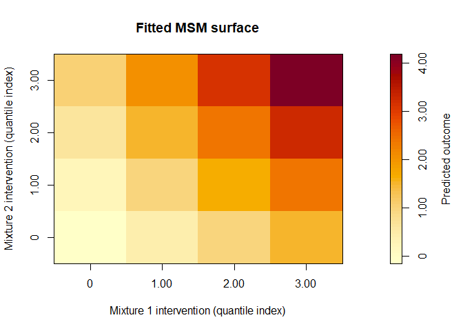
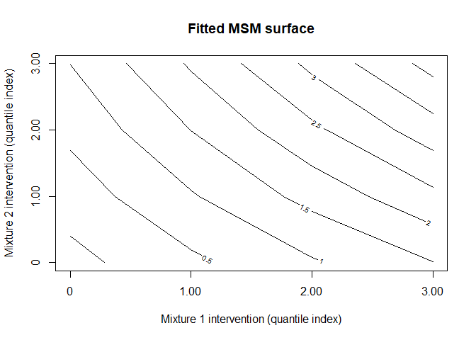

<!-- README.md is generated from README.Rmd. Please edit that file -->

# qgcomp.multi

<!-- badges: start -->
<!-- badges: end -->

## Overview

`qgcomp.multi` is an extension of quantile g-computation (Keil et al.,
2020) to settings with multiple exposure mixtures and their interaction.

In many environmental and epidemiologic studies, exposures arise in
distinct groups (e.g., metals, phthalates, phenols) that may jointly
influence health outcomes. While standard quantile g-computation
estimates the effect of a single mixture, `qgcomp.multi` allows users
to:

- Estimate the effect of two exposure mixtures simultaneously
- Evaluate interactions between mixtures
- Fit the model using either quantized exposures or the original
  exposure scales via `q = NULL`
- Obtain interpretable effect estimates via marginal structural models
  (MSMs)

The current package interface is designed for analyses with exactly two
mixtures, supplied through `mix1` and `mix2`.

## Installation

You can install the development version from GitHub:

``` r
devtools::install_github("cmowrer13/qgcomp.multi")
```

## Basic Usage

Fit a two-mixture quantile g-computation model:

``` r
library(qgcomp.multi)

fit <- qgcomp.glm.multi(
  f = Y ~ X1 + X2 + X3 + W1 + W2 + W3 + C,
  data = dataset,
  mix1 = c("X1", "X2", "X3"),
  mix2 = c("W1", "W2", "W3"),
  interaction = TRUE,
  q = 4,
  B = 100,
  seed = 13
)

fit
summary(fit)
coef(fit)
vcov(fit)
confint(fit)
formula(fit)
nobs(fit)
```

The returned object is a fitted `qgcompmulti` model object. In routine
use, the recommended workflow is:

- fit the model with `qgcomp.glm.multi()`
- inspect the fitted object with `print()` or by typing `fit`
- call `summary(fit)` for a fuller report
- use standard generics such as `coef()`, `vcov()`, `confint()`,
  `formula()`, and `nobs()` to extract specific fitted-model components
- optionally supply `seed` when you want bootstrap and Monte Carlo draws
  to be reproducible across repeated fits

The `0.3.0` interface then extends into:

- `predict()` for MSM-based prediction, direct contrasts, and exact
  prediction targets
- `plot()` for fitted MSM surface displays
- `support()`, `diagnostics()`, and `adequacy()` for model checking
- `mcsize_sensitivity()` and `q_sensitivity()` for practical robustness
  checks

## Specifying the Outcome Model

The `f` argument is the outcome regression formula. In most applications
it should include:

- the outcome variable
- all exposure variables named in `mix1` and `mix2`
- covariates you want included in the outcome model

The `mix1` and `mix2` arguments define which exposure variables belong
to each mixture. They do not automatically add variables to the formula,
so the exposures should still appear in `f`.

## Interpreting the MSM coefficients

The main estimands are the coefficients of the marginal structural model
(MSM):

- `psi1` is the Mixture 1 main effect
- `psi2` is the Mixture 2 main effect
- `psi1:psi2` is the mixture interaction when `interaction = TRUE`

When `q` is an integer, these coefficients describe the change in the
expected outcome associated with a one-quantile simultaneous increase in
all components of the corresponding mixture. When `q = NULL`, the
coefficients are defined on the original-scale intervention structure
used to build the MSM, so their units depend on the exposure scales. In
both cases, the MSM is fit to predicted potential outcomes on the
response scale.

Interpretation also depends on the outcome type used in the outcome
model:

- for continuous outcomes, the MSM coefficients are mean differences
- for binary outcomes fit with `family = binomial()`, they are risk
  differences
- for count outcomes fit with `family = poisson()`, they are differences
  in expected counts

## Simulated Example

Generate a dataset with known mixture effects and inspect the fitted
model through the model-object workflow:

``` r
library(qgcomp.multi)

dat <- sim_mixture_data(
  n = 1000,
  pA = 3,
  pB = 3,
  rho_within_A = 0.3,
  rho_within_B = 0.3,
  rho_between = 0.2,
  psi1 = 0.5,
  psi2 = 0.3,
  psi12 = 0.2,
  seed = 123
)

fit <- qgcomp.glm.multi(
  f = Y ~ X1 + X2 + X3 + W1 + W2 + W3 + C,
  data = dat,
  mix1 = c("X1", "X2", "X3"),
  mix2 = c("W1", "W2", "W3"),
  B = 100,
  seed = 13
)

fit
#> qgcompmulti fit
#> 
#> Call:
#> qgcomp.glm.multi(f = Y ~ X1 + X2 + X3 + W1 + W2 + W3 + C, data = dat, 
#>     mix1 = c("X1", "X2", "X3"), mix2 = c("W1", "W2", "W3"), B = 100, 
#>     seed = 13)
#> 
#> Model:
#>   Outcome: Y
#>   Family: gaussian (identity)
#>   Observations used: 1000
#>   Exposure mode: Quantized exposures (q = 4)
#>   MSM interaction: included
#>   Random seed: 13
#> 
#> Mixtures:
#>   Mixture 1: X1, X2, X3
#>   Mixture 2: W1, W2, W3
#> 
#> MSM coefficients:
#>                        Estimate Std. Error z value  Pr(>|z|)    
#> Intercept             -0.153249   0.130625 -1.1732 0.2407179    
#> Mixture 1 main effect  0.546206   0.085165  6.4135 1.422e-10 ***
#> Mixture 2 main effect  0.386574   0.089292  4.3293 1.496e-05 ***
#> Mixture interaction    0.170116   0.051373  3.3114 0.0009282 ***
#> ---
#> Signif. codes:  0 '***' 0.001 '**' 0.01 '*' 0.05 '.' 0.1 ' ' 1

coef(fit)
#> (Intercept)        psi1        psi2   psi1:psi2 
#>  -0.1532490   0.5462062   0.3865741   0.1701165

confint(fit)
#>                   2.5 %    97.5 %
#> (Intercept) -0.40927019 0.1027722
#> psi1         0.37928521 0.7131271
#> psi2         0.21156465 0.5615836
#> psi1:psi2    0.06942787 0.2708050
```

For a fuller report that still keeps the MSM as the primary focus, call:

``` r
summary(fit)
#> Summary of qgcompmulti fit
#> 
#> Call:
#> qgcomp.glm.multi(f = Y ~ X1 + X2 + X3 + W1 + W2 + W3 + C, data = dat, 
#>     mix1 = c("X1", "X2", "X3"), mix2 = c("W1", "W2", "W3"), B = 100, 
#>     seed = 13)
#> 
#> Model overview:
#>   Formula: Y ~ X1 + X2 + X3 + W1 + W2 + W3 + C
#>   Outcome: Y
#>   Family: gaussian (identity)
#>   Observations used: 1000
#>   Exposure mode: Quantized exposures (q = 4)
#>   MSM interaction: included
#>   Bootstrap replications: 100
#>   Monte Carlo size: 1000
#>   Random seed: 13
#> 
#> Mixtures:
#>   Mixture 1: X1, X2, X3
#>   Mixture 2: W1, W2, W3
#> 
#> MSM coefficients:
#>                        Estimate Std. Error z value  Pr(>|z|)    
#> Intercept             -0.153249   0.130625 -1.1732 0.2407179    
#> Mixture 1 main effect  0.546206   0.085165  6.4135 1.422e-10 ***
#> Mixture 2 main effect  0.386574   0.089292  4.3293 1.496e-05 ***
#> Mixture interaction    0.170116   0.051373  3.3114 0.0009282 ***
#> ---
#> Signif. codes:  0 '***' 0.001 '**' 0.01 '*' 0.05 '.' 0.1 ' ' 1
#> 
#> Outcome model context:
#>   Model class: glm
#>   Estimated parameters: 9
#>   AIC: 2844.826
#>   Null deviance: 2992.077
#>   Residual deviance: 987.034
```

## Prediction Workflow

The default prediction target is the fitted marginal structural model
(MSM) surface:

``` r
pred_msm <- predict(fit)
head(pred_msm$estimates)
#>   grid_id psi1 psi2   estimate
#> 1       1    0    0 -0.1532490
#> 2       2    1    0  0.3929572
#> 3       3    2    0  0.9391633
#> 4       4    3    0  1.4853695
#> 5       5    0    1  0.2333251
#> 6       6    1    1  0.9496477
```

You can also request direct MSM contrasts between two intervention
regimes:

``` r
predict(
  fit,
  type = "msm_contrast",
  from = c(psi1 = 0, psi2 = 0),
  to = c(psi1 = 3, psi2 = 3),
  interval = TRUE
)
#> $prediction_type
#> [1] "msm_contrast"
#> 
#> $grid_type
#> [1] "pairwise_regime"
#> 
#> $grid_scale
#> [1] "msm"
#> 
#> $estimand_scale
#> [1] "response"
#> 
#> $estimates
#>   from_psi1 from_psi2 to_psi1 to_psi2 estimate
#> 1         0         0       3       3 4.329389
#> 
#> $intervals
#>   from_psi1 from_psi2 to_psi1 to_psi2    lower    upper
#> 1         0         0       3       3 4.038272 4.631856
#> 
#> $interval_type
#> [1] "bootstrap_percentile"
#> 
#> $uncertainty_source
#> [1] "stored_bootstrap_draws"
#> 
#> $data_supplied
#> [1] FALSE
#> 
#> $contrast
#> [1] TRUE
```

### MSM versus exact predictions

`qgcomp.multi` distinguishes between:

- MSM-based predictions, which come from the fitted marginal structural
  model
- exact counterfactual predictions, which come directly from the fitted
  outcome model The stored fit-time exact surface can be extracted
  without any additional data:

``` r
predict(fit, type = "exact")
#> $prediction_type
#> [1] "exact_fit_surface"
#> 
#> $grid_type
#> [1] "stored_fit_grid"
#> 
#> $grid_scale
#> [1] "intervention"
#> 
#> $estimand_scale
#> [1] "response"
#> 
#> $estimates
#>    grid_id intervention_psi1 intervention_psi2 msm_psi1 msm_psi2 exact_mean
#> 1        1                 0                 0        0        0 -0.1532490
#> 2        2                 1                 0        1        0  0.3929572
#> 3        3                 2                 0        2        0  0.9391633
#> 4        4                 3                 0        3        0  1.4853695
#> 5        5                 0                 1        0        1  0.2333251
#> 6        6                 1                 1        1        1  0.9496477
#> 7        7                 2                 1        2        1  1.6659704
#> 8        8                 3                 1        3        1  2.3822930
#> 9        9                 0                 2        0        2  0.6198992
#> 10      10                 1                 2        1        2  1.5063383
#> 11      11                 2                 2        2        2  2.3927774
#> 12      12                 3                 2        3        2  3.2792165
#> 13      13                 0                 3        0        3  1.0064733
#> 14      14                 1                 3        1        3  2.0630288
#> 15      15                 2                 3        2        3  3.1195844
#> 16      16                 3                 3        3        3  4.1761399
#> 
#> $intervals
#> NULL
#> 
#> $interval_type
#> NULL
#> 
#> $uncertainty_source
#> NULL
#> 
#> $data_supplied
#> [1] FALSE
#> 
#> $contrast
#> [1] FALSE
```

For arbitrary exact prediction at a new intervention regime, the user
must supply `data`:

``` r
predict(
  fit,
  type = "exact",
  data = dat,
  at = c(psi1 = 1, psi2 = 2)
)
#> $prediction_type
#> [1] "exact_arbitrary"
#> 
#> $grid_type
#> [1] "point_regime"
#> 
#> $grid_scale
#> [1] "intervention"
#> 
#> $estimand_scale
#> [1] "response"
#> 
#> $estimates
#>   grid_id intervention_psi1 intervention_psi2 msm_psi1 msm_psi2 exact_mean
#> 1       1                 1                 2        1        2   1.506338
#> 
#> $intervals
#> NULL
#> 
#> $interval_type
#> NULL
#> 
#> $uncertainty_source
#> NULL
#> 
#> $data_supplied
#> [1] TRUE
#> 
#> $contrast
#> [1] FALSE
```

Supplying `data` is required here because an exact counterfactual mean
is defined by averaging predicted potential outcomes over a concrete
covariate distribution. Without user-supplied data, the package does not
know which covariate distribution to average over, so it can only return
the exact surface that was already computed and stored at fit time.

In Version `0.3.0`, interval support is currently limited to MSM-based
predictions.

## Plotting Workflow

The default plot is a heatmap of the fitted MSM surface over the stored
intervention grid:

``` r
plot(fit)
```



You can switch to a contour display:

``` r
plot(fit, style = "contour")
```



To visualize uncertainty, use the slice-based interval display:

``` r
plot(
  fit,
  interval = TRUE,
  slice = list(var = "psi2", value = 1)
)
```

When `q = NULL`, the stored heatmap axes are labeled with the pooled
25th/50th/75th percentile intervention values used at fit time, rather
than the centered MSM coordinates used internally when
`centering = "median"`.

## Diagnostics Workflow

Support, bootstrap behavior, and MSM adequacy are all available through
public diagnostic helpers:

``` r
support(fit)
#> qgcompmulti intervention support diagnostic
#> 
#> Mode: quantized
#> Centering: none
#> Grid points: 16
#> Intervention psi1 range: [0, 3.00]
#> Intervention psi2 range: [0, 3.00]
diagnostics(fit, type = "bootstrap")
#> qgcompmulti bootstrap diagnostic
#> 
#> Requested replications: 100
#> Successful replications: 100
#> Failed replications: 0
#> Success rate: 100.000%
adequacy(fit)
#> qgcompmulti MSM adequacy diagnostic
#> 
#> Grid points: 16
#> Mean absolute error: 0.000
#> RMSE: 0.000
#> Maximum absolute error: 0.000
#> Mean signed error: 0.000
#> Correlation: 1.000
#> 
#> Adequacy compares the exact fit-time counterfactual surface to the fitted MSM surface on the response scale.
```

These diagnostics are deliberately kept outside the main model summary
so that users can inspect model behavior explicitly rather than relying
on a very dense `summary()` output.

Two important interpretation notes: \* support diagnostics summarize the
intervention grid and are especially informative for `q = NULL` \*
adequacy diagnostics compare the exact fit-time counterfactual surface
to the fitted MSM surface on the response scale

## Sensitivity Workflow

The package includes dedicated helpers for sensitivity to Monte Carlo
size and quantization choice:

``` r
mcsize_sensitivity(
  f = Y ~ X1 + X2 + X3 + W1 + W2 + W3 + C,
  data = dat,
  mix1 = c("X1", "X2", "X3"),
  mix2 = c("W1", "W2", "W3"),
  MCsize_values = c(250, 500, 1000),
  q = 4,
  B = 100,
  seed = 13
)

q_sensitivity(
  f = Y ~ X1 + X2 + X3 + W1 + W2 + W3 + C,
  data = dat,
  mix1 = c("X1", "X2", "X3"),
  mix2 = c("W1", "W2", "W3"),
  q_values = c(3, 4, 5),
  B = 100,
  seed = 13
)
```

For `q` sensitivity, raw coefficient magnitudes should not be
interpreted naively across different `q` values. A larger `q` means that
a one-quantile increase is a smaller intervention step, so smaller
effect sizes may be expected mechanically rather than indicating a
weaker overall mixture effect.

## Original-Scale Fitting with `q = NULL`

If you do not want to quantize exposures, set `q = NULL`. In that case,
the outcome model is fit on the original exposure scales and the MSM is
built over a common pooled intervention grid within each mixture.

``` r
fit_cont <- qgcomp.glm.multi(
  f = Y ~ X1 + X2 + X3 + W1 + W2 + W3 + C,
  data = dataset,
  mix1 = c("X1", "X2", "X3"),
  mix2 = c("W1", "W2", "W3"),
  interaction = TRUE,
  q = NULL,
  centering = "median",
  B = 100,
  seed = 13
)
 
summary(fit_cont)
coef(fit_cont)
confint(fit_cont)
```

With `q = NULL`, the MSM coefficients are interpreted with respect to
the original-scale exposure coding rather than a one-quantile increase.
Choosing `centering = "median"` makes the intercept correspond to the
predicted outcome when both mixtures are set to their pooled medians.

## Computational Considerations

The g-computation step requires prediction over a grid of intervention
levels for both mixtures, which can become computationally intensive.

To address this, `qgcomp.multi` includes a Monte Carlo approximation:

- `MCsize` = nrow(data) → full computation
- `MCsize` \< nrow(data) → approximate marginalization

This can substantially reduce runtime in large datasets while preserving
model structure.

In practice:

- use a smaller `B` while developing code and checking model
  specification
- increase `B` for your final analysis once the model is stable
- keep `MCsize = nrow(data)` when full g-computation is feasible
- consider a smaller `MCsize` when runtime is prohibitive, especially in
  large samples
- use `seed` when you need the bootstrap-based inferential results to be
  exactly reproducible across reruns

## Core Functions and Methods

Core functions include:

- `qgcomp.glm.multi()` — main estimation function
- `qgcompmulti_msm_fit()` — MSM estimation routine
- `quantize_mixtures()` — exposure quantization
- `sim_mixture_data()` — simulation data generator

The standard fitted-model methods include:

- `print()` — compact interactive display of the fitted object
- `summary()` — fuller model summary with MSM results in the foreground
- `coef()` — MSM coefficients
- `vcov()` — covariance matrix for the MSM coefficients
- `confint()` — Wald confidence intervals for the MSM coefficients
- `formula()` — original fitted formula
- `nobs()` — number of observations actually used

New `0.3.0` public methods include:

- `predict()` — MSM predictions, contrasts, and exact prediction targets
- `plot()` — MSM surface plotting
- `diagnostics()` — structured model diagnostics
- `support()` — intervention support diagnostic
- `adequacy()` — MSM adequacy diagnostic
- `mcsize_sensitivity()` — repeated-fit sensitivity to Monte Carlo size
- `q_sensitivity()` — repeated-fit sensitivity to quantization choice

## References

Keil AP, Buckley JP, O’Brien KM, Ferguson KK, Zhao S, White AJ. A
Quantile-Based g-Computation Approach to Addressing the Effects of
Exposure Mixtures. Environmental Health Perspectives.
2020;128(4):047004.

## Development

This package is under active development. Contributions, issues, and
suggestions are welcome:

<https://github.com/cmowrer13/qgcomp.multi>
